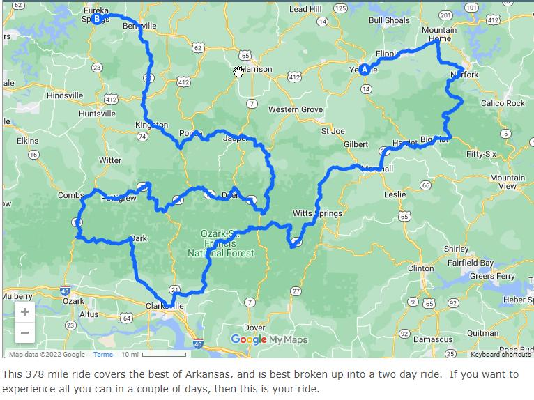

# Ozarks and Kansas City

Trip to Kansas City bracketed by a few days in the Ozarks.

Expected mileage: 2,000 - 3,000 miles.

## Days & Stops

1. Fri: Houston ➡ Hot Springs or Arkadelphia
2. Sat: ➡ Harrison
3. Sun: Around Harrison
4. Mon: Around Harrison
5. Tue: Harrison ➡ Kansas City
6. Wed: Kansas City
7. Thu: Kansas City
8. Fri: Kansas City ➡ Mountain Home
9. Sat: ➡ Little Rock or Arkadelphia
10. Sun: ➡ Houston

Rough distances:

- Houston ➡ Hot Springs: 405 miles; 6:40
- Mountain Home ➡ Kansas City: 270 miles; 4:30
- Kansas City ➡ Little Rock through Springfield ➡ Mountain View ➡ Greers Ferry: 450 miles; 8 hours
- Little Rock ➡ Houston: 440 miles; 7 hours
- Arkadelphia ➡ Houston: 370 miles; 6 hours

## Rides

### [The Whole Hog](https://www.ozarkrides.com/the%20whole%20hog.htm)  

> This 378 mile ride covers the best of Arkansas,
  and is best broken up into a two day ride.  
  If you want toexperience all you can in a couple of days, then this is your ride.  

- [GPX File](../artifacts/2022-Ozarks/The_Whole_Hog_Ride.gpx)

### From the [Arkansas.com Motorcycle Trip Guide](https://www.arkansas.com/things-to-do/motoring-byways/motorcycling)

Roughly in order of planned riding:

- [#11 - Arkansas Scenic 7 Byway](https://www.arkansas.com/arkansas-scenic-7-byway-0)  
  > This nationally recognized treasure traverses nearly the entire state
  - 302 miles; 6:46 (likely shorter)
  - [Google Maps Route](https://www.google.com/maps/d/viewer?mid=1MrdAQEjTA5G92WKFa-RgMWn7RyU&ll=34.76283129079722%2C-92.90677839999998&z=9)
  - [GPX File](../artifacts/2022-Ozarks/Arkansas_Scenic_7_Byway.gpx)
- [#10 - Mount Magazine/Wine Country Loop](https://www.arkansas.com/mount-magazinewine-country-loop)  
  > Switchbacks, tight curves, and ear-popping elevation changes
  - 150 miles; 3:16
  - [Google Maps Route](https://www.google.com/maps/d/viewer?mid=1exB12f1V3gKkI4p0lr7PWOpfzzk7u3Ec&ll=35.26027934920221%2C-93.49370499999999&z=11)
  - [GPX File](../artifacts/2022-Ozarks/Mount_Magazine_Wine_Country_Loop.gpx)
- [#3 - Harrison to Eureka Springs Back Roads Run](https://www.arkansas.com/harrison-eureka-springs-back-roads-run)  
  > Some of the best riding in the Ozarks with drop-dead gorgeous landscapes
  - 159 miles; 3:40
  - [Google Maps Route](https://www.google.com/maps/d/viewer?mid=1_gKFgWvEI3LFm3Gov-CRm7Ewcr1YkM1E&ll=36.235972490503556%2C-93.4358&z=11)
  - [GPX File](../artifacts/2022-Ozarks/Harrison_To_Euraka_Springs_Back_Roads_Run.gpx)
- [#1 - Eureka Springs Art & Heritage Tour](https://www.arkansas.com/eureka-springs-art-heritage-tour)  
  > A tight loop with Historic towns, fantastic scenery, and world-class art
  - 115 miles; 2:50.
  - Maybe combined with #3 for a total of 274 miles, 6:30.  
    Or with #4 for a total of 224 miles, 4:13.
  - [Google Maps Route](https://www.google.com/maps/d/viewer?mid=1BCZNRhWvY7k1_t8osdLHKVNOKikaK5n3&ll%E2%80%A6&ll=36.28649547469322%2C-93.96724500000002&z=12)
  - [GPX File](../artifacts/2022-Ozarks/Eureka_Springs_Art_Tour.gpx)
- [#4 - Pig Trail Scenic Byway]()  
  > The one, the only, the legendary Pig Trail – ready for an unforgettable ride?
  - 105 miles; 2:23
  - Could do after #1; 220 miles, 5:13
  - [Google Maps Route](https://www.google.com/maps/d/viewer?mid=1VXHC_VFRL9Pv1Q2JGswRemzHkB8yqH_S&ll=35.91762336878234%2C-93.66771810000002&z=11)
  - [GPX File](../artifacts/2022-Ozarks/Pig_Trail_Scenic_Byway.gpx)
- [#6 - Arkansas's Grand Canyon](https://www.arkansas.com/arkansass-grand-canyon)  
  > Scenery and excitement level that, on a scale of 1-10, is a definite 11
  - 157 miles; 3:25
  - Could do a portion after #1 + #4, 377 miles; 8:38
  - [Google Maps Route](https://www.google.com/maps/d/viewer?mid=1_xa-Xm65Jcngp6ipwjdDL0FGMYfBSYgP&ll=35.65612032438403%2C-93.26187&z=11)
  - [GPX File](../artifacts/2022-Ozarks/Arkanas_Grand_Canyon.gpx)

The following are all small rides South of Harrison
- [#9 - Ozark Moonshine Run](https://www.arkansas.com/ozark-moonshine-run)
  > A spectacular, moderate-length tour of the heart of the Ozarks
  - 109 miles; 2:35.
  - [Google Maps Route](https://www.google.com/maps/d/viewer?mid=1QfP4qMNn16G7uD2_h_gVji7rY7-nXVmb&ll=35.992807081517775%2C-93.221175&z=12)
  - [GPX File](../artifacts/2022-Ozarks/Ozark_Moonshine_Run.gpx)
- [#5 - Twisted Lady](https://www.arkansas.com/twisted-lady)  
  > Where fascinating folklore twists and turns as much as the ride
  - 96 miles; 2:10
  - [Google Maps Route](https://www.google.com/maps/d/viewer?mid=1vZK0xD7ZOZAmKadSTO2k8NSsqas1274a&ll=36.021160652707685%2C-93.25657000000001&z=12)
  - [GPX File](../artifacts/2022-Ozarks/Twisted_Lady.gpx)
- [#8 - Jasper Disaster](https://www.arkansas.com/jasper-disaster)  
  > Excitement around every turn and switchback - rural roads at their best!
  - 54 miles; 1:20
  - [Google Maps Route](https://www.google.com/maps/d/viewer?mid=1e9aAwHYBvKzA_B-CPMsDGJOkMEgP3CJ2&ll=36.10054663572684%2C-93.24235999999998&z=12)
  - [GPX File](../artifacts/2022-Ozarks/Jasper_Disaster.gpx)

The following are rides around Mountain Home:
- #17 - Growl & Lasso Rides [Beer Creek Growl](https://www.arkansas.com/growl-and-lasso-bear-creek-growl)
  and [Leslie Lasso](https://www.arkansas.com/growl-and-lasso-leslie-lasso)  
  > Double the beautiful scenery and sweeping curves, double the fun
  - Total 128 miles; 3:05
  - Bear Creek Growl is 57 miles; Leslie Lasso is 71 miles.
  - [Google Maps Route - Bear Creek Growl](https://www.google.com/maps/d/viewer?mid=1zFx1lz-lDsWp9yp_RLK7leYvfKQzeD8r&ll=35.80655065511662%2C-92.75053999999999&z=12)
  - [Google Maps Route - Leslie Lasso](https://www.google.com/maps/d/viewer?mid=1lpA65DzIrNROPvARJ0mCzelXQTJElboC&ll=35.91152756113667%2C-92.46784000000001&z=12)
  - [GPX File - Bear Creek Growl](../artifacts/2022-Ozarks/Growl_And_Lasso_-_Bear_Creek_Growl.gpx)
  - [GPX File - Leslie Lasso](../artifacts/2022-Ozarks/Growl_And_Lasso_-_Leslie_Lasso.gpx)
- [#18 - Push Mountain Road/Sylamore Scenic Byway](https://www.arkansas.com/push-mountain-roadsylamore-scenic-byway)  
  > Will it be sport riding or scenic cruising? Choose your own adventure
  - AR 14 West + AR 341 for twisties; AR 5/Sylamore Scenic Byway going South for views
  - 149 miles; 3:26
  - [Google Maps Route for AR 14 + AR 341 variant](https://www.google.com/maps/d/viewer?mid=15WleHpxTVrmCcYp3XcDczL3WBmY&ll=36.12980814407212%2C-92.39169000000001&z=11)
  - [GPX File](../artifacts/2022-Ozarks/Push_Mountain_Road_-_Sycamore_Scenic_Byway.gpx)

From the South point of #18, head south on AR 5 for a portion of 
[#19 -Spring River to Greers Ferry Lake](https://www.arkansas.com/spring-river-greers-ferry-lake),
then the West portion of loop #20 leads into Little Rock.  
This is [280 miles; 6:30 ride](https://www.google.com/maps/dir/Mountain+Home,+AR/Bull+Shoals,+AR/little+rock/@35.4809782,-92.4689575,10.5z/data=!4m60!4m59!1m5!1m1!1s0x87d1d95b08f5fca5:0x86906e2c61e4fc25!2m2!1d-92.385217!2d36.3400904!1m45!1m1!1s0x87ce251a8927f85b:0x51c969882b9dd0d0!2m2!1d-92.5833435!2d36.3839278!3m4!1m2!1d-92.6742069!2d36.1610979!3s0x87ce16c144d50257:0xb6e8402f76ea77ce!3m4!1m2!1d-92.3228862!2d36.1010655!3s0x87d1e50dbcd0f00b:0xd3e94a7308e7826f!3m4!1m2!1d-92.2768337!2d36.2077643!3s0x87d1e85b0ea7c205:0xa12210892c68383e!3m4!1m2!1d-92.1682862!2d35.5807564!3s0x87d2150d23574ebf:0x57835510a7be7d60!3m4!1m2!1d-92.4513283!2d35.5820333!3s0x87d20a87da847a8f:0xac792fba10a898e7!3m4!1m2!1d-92.4820989!2d35.3246396!3s0x87cd879f18e897d1:0x4198af9c70b53f1b!3m4!1m2!1d-92.7957136!2d34.9817615!3s0x87cd12c06622fcdb:0x95318ddc4d4e2242!3m4!1m2!1d-92.6038641!2d34.9380541!3s0x87cd65eeb6093ef7:0x75422479e4f7019e!1m5!1m1!1s0x87d2a134a11f569b:0x3405f5100df35b17!2m2!1d-92.2880157!2d34.7444618!3e0?hl=en)
- [#20 - Greers Ferry Loop to Pinnacle Mountain](https://www.arkansas.com/greers-ferry-loop-pinnacle-mountain)  
  > A pleasant run through gorgeous pastoral scenery in the Ouachita foothills
  - 225 miles; 4:53
  - [Google Maps Route](https://www.google.com/maps/d/viewer?mid=1o-bL4_CoRJZjLfRbb_B5UEINA5dbY55E&ll=35.19289003419641%2C-92.3648&z=11)
  - [GPX File](../artifacts/2022-Ozarks/Greers_Ferry_Loop_To_Pinnacle_Mountain.gpx)
